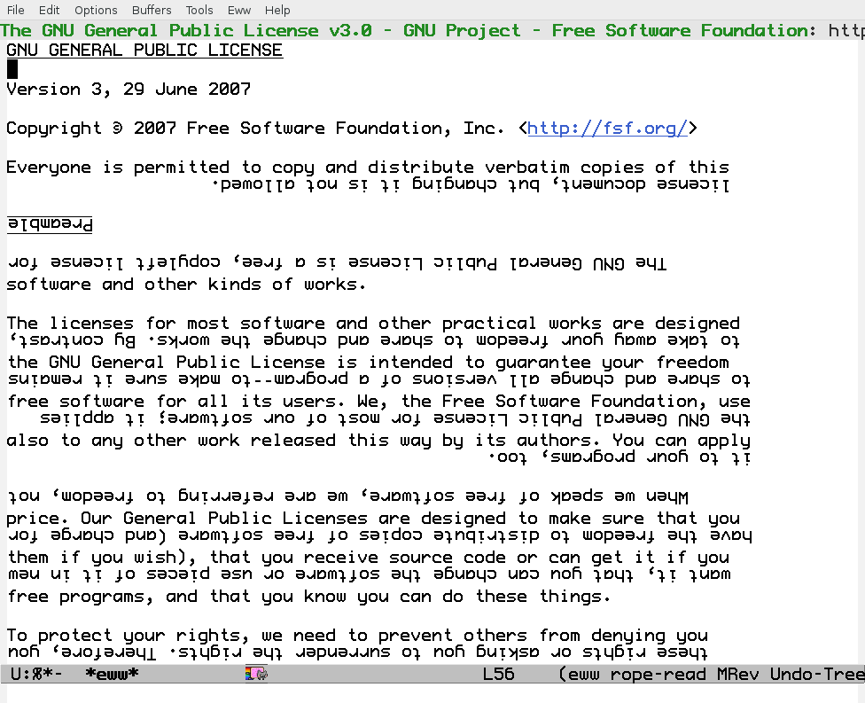

<h2>Table of Contents</h2>

<ul>
<li><a href="#sec-1">1. What rope-read-mode is</a>
<ul>
<li><a href="#sec-1-1">1.1. Illustration</a></li>
<li><a href="#sec-1-2">1.2. Benefits</a></li>
<li><a href="#sec-1-3">1.3. Price</a></li>
</ul>
</li>
<li><a href="#sec-2">2. Usage</a>
<ul>
<li><a href="#sec-2-1">2.1. Transformation speed vs. quality</a></li>
</ul>
</li>
<li><a href="#sec-3">3. Install</a>
<ul>
<li><a href="#sec-3-1">3.1. Emacs Package</a></li>
<li><a href="#sec-3-2">3.2. Install from el file</a></li>
</ul>
</li>
<li><a href="#sec-4">4. Dependencies</a></li>
<li><a href="#sec-5">5. Development</a>
<ul>
<li><a href="#sec-5-1">5.1. Known Bugs</a></li>
<li><a href="#sec-5-2">5.2. Wishes</a></li>
<li><a href="#sec-5-3">5.3. Vision</a></li>
<li><a href="#sec-5-4">5.4. Lentic Literate Style</a></li>
<li><a href="#sec-5-5">5.5. Contributors</a></li>
</ul>
</li>
<li><a href="#sec-6">6. Communication</a></li>
<li><a href="#sec-7">7. Links</a></li>
<li><a href="#sec-8">8. History</a></li>
</ul>

# What rope-read-mode is

`rope-read-mode` reverses every other line in the visible part of a
buffer.  When every other line has been reversed reading is like
following a rope.

## Illustration

## Benefits

-   Find the next line easily.
    -   In particular for long lines.
-   Have an alternative view on text.
-   Have fun.

## Price

Typically you need to invest some time to learn to read upside-down
lines.

# Usage

Type `M-x rope-read-mode` in a buffer and wait until the
transformation of the buffer has been performed.  Type
`M-x rope-read-mode` again to leave the mode.

You can use:

-   q to quit.
-   SPC / <backspace> S-SPC to scroll a screen.
-   v <return> / V y to scroll one line.
-   g to refresh rope read.
-   ? to open the help buffer.
-   any method to reach a location in the buffer and then press g to
    trigger the transformation of the current view.

For convenience command rope-read-mode can be bound to a key
sequence.  For example to activate or deactivate rope-read-mode by
pressing scroll lock two times use the line

    (global-set-key (kbd "<Scroll_Lock> <Scroll_Lock>") 'rope-read-mode)

## Transformation speed vs. quality

The calculation of the relevant y-coordinates for the transformation
can be controlled somewhat by variable
\`rope-read-calculate-exact-y-coordinates'.

For uniform text (without superscripts and images) using the y-size of
an arbitrary character of the text yields good results.  Set variable
`rope-read-calculate-exact-y-coordinates` to nil to use this
heuristic.  The variable can be set via `M-x customize-variable`.

Set `rope-read-calculate-exact-y-coordinates` to t to calculate the
y-coordinates exactly (hopefully).  This slows down the
transformation considerably.

# Install

## Emacs Package

When installed as Emacs package
 then there is
no need of a special configuration.

## Install from el file

If you just have the emacs-lisp file then:

-   load the file into Emacs
-   do `M-x eval-buffer`

That's it.  You installed rope-read-mode and `M-x rope-read-mode` is
available.

# Dependencies

-   Emacs is running under X.
-   The programm `convert` of the ImageMagick-suite is available.

The `convert` program has the job to create images of lines and rotate
them.

# Development

## Known Bugs

-   rope-read-mode fails when truncated lines occur.

## Wishes

-   Quicker transformation.

## Vision

rope-read-mode gets rope-mode which allows also editing.  rope-mode
would provide a further possibility for the user to use Emacs, just as
changing the default font.

## Lentic Literate Style

This program is written in emacs lisp in lentic style based on the
'lentic' package .

This means the that this file can be regarded just as an emacs lisp
file.  But actually this file contains extra comments which allow the
interpretation of the file as Org file.  Lentic-mode makes it easy to
write this style.

A possible initialization of lentic is this:

    (global-lentic-start-mode)

Find more about lentic at
.

## Contributors

<table border="2" cellspacing="0" cellpadding="6" rules="groups" frame="hsides">

<colgroup>
<col  class="left" />
</colgroup>
<tbody>
<tr>
<td class="left">Syohei YOSHIDA</td>
</tr>

<tr>
<td class="left">Marco WAHL</td>
</tr>
</tbody>
</table>

# Communication

Use the GitHub infrastructure i.e. pull requests or
<https://github.com/marcowahl/rope-read-mode/issues>.  Or contact the
author directly.

# Links

-   'spray' which is available as Elpa package
     realizes another
    alternative view mode.
-   'fliptext' which also is available as Elpa package
     realizes an
    ˙ʇxǝʇ pǝddılɟ ɹoɟ poɥʇǝɯ-ʇnduı

# History

<table border="2" cellspacing="0" cellpadding="6" rules="groups" frame="hsides">

<colgroup>
<col  class="right" />

<col  class="left" />
</colgroup>
<tbody>
<tr>
<td class="right">201501151211</td>
<td class="left">v0.1 New option rope-read-calculate-exact-y-coordinates</td>
</tr>
</tbody>
</table>
